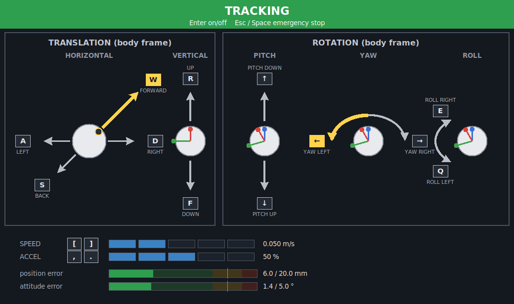
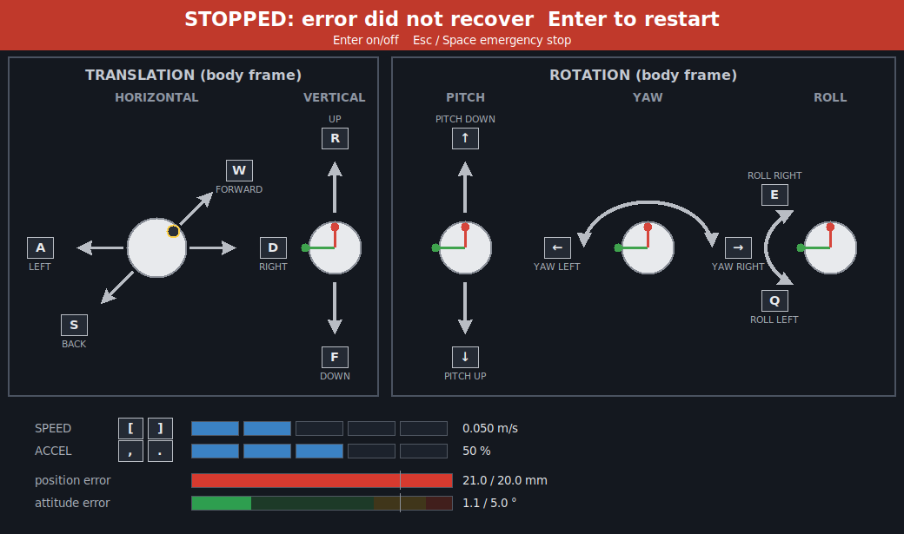

<a name="readme-top"></a>

[![Contributors][contributors-shield]][contributors-url]
[![Forks][forks-shield]][forks-url]
[![Stargazers][stars-shield]][stars-url]
[![Issues][issues-shield]][issues-url]
[![License][license-shield]][license-url]

# sobits_intball2_gnc

<!-- 目次 -->
<details>
  <summary>目次</summary>
  <ol>
    <li>
      <a href="#概要">概要</a>
    </li>
    <li>
      <a href="#gncの枠組みでの位置づけ">GNCの枠組みでの位置づけ</a>
    </li>
    <li>
      <a href="#パッケージ構成">パッケージ構成</a>
    </li>
    <li>
      <a href="#セットアップ">セットアップ</a>
      <ul>
        <li><a href="#環境条件">環境条件</a></li>
        <li><a href="#インストール方法">インストール方法</a></li>
      </ul>
    </li>
    <li><a href="#実行方法">実行方法</a></li>
    <li><a href="#キーボードテレオペ">キーボードテレオペ</a></li>
    <li><a href="#マイルストーン">マイルストーン</a></li>
  </ol>
</details>

## 概要

Int-Ball2 シミュレータでロボットを自律移動させるためのパッケージです．
ROS2 Humble に対応しています．

<p align="right">(<a href="#readme-top">上に戻る</a>)</p>


### パッケージ構成

```
sobits_intball2_gnc/                 # gitリポジトリルート（colconパッケージを2つ内包）
├── gnc_py/                          # パッケージ sobits_intball2_gnc: メインパッケージ（ament_python）
│   ├── config/
│   │   ├── gnc_params.yaml          # GNC パラメータ（ROS2 param 形式：ファン配置・推力モデル・制御ゲイン）
│   │   └── virtual_camera.yaml      # 仮想カメラのパラメータ（カメラ・解像度・距離・メッシュ対応表）
│   ├── maps/
│   │   └── iss_location.yaml        # 登録済みロケーション一覧（27地点）
│   ├── sobits_intball2_gnc/
│   │   ├── navigation/              # Navigation（N）: 詳細は navigation/README.md
│   │   ├── control/                 # Control（C）: 詳細は control/README.md
│   │   └── guidance/                # Guidance（G）: min_snap.pyのコアロジックのみ未実装、詳細は guidance/README.md
│   ├── test/                        # 各ロジックの単体テスト（ROS 不要）
│   ├── package.xml
│   ├── setup.py
│   └── setup.cfg
└── gnc_cpp/                         # パッケージ sobits_intball2_gnc_cpp: C++実装とそのpybind11拡張（ament_cmake）
    ├── package.xml
    ├── CMakeLists.txt
    ├── include/sobits_intball2_gnc_cpp/  # 公開ヘッダ（common/ mapping/ guidance/ perception/）
    ├── src/                         # 実装（includeと同じ並び）。perception/virtual_camera_node.cppは仮想カメラのROSノード
    ├── python/                      # pybind11バインディング
    └── config/                      # wrench envelope CSV
```


<p align="right">(<a href="#readme-top">上に戻る</a>)</p>


## セットアップ

### 環境条件

まず，以下の環境を整えてから，次のインストール方法に進んでください．

| System  | Version |
| --- | --- |
| Ubuntu | 22.04 (Jammy Jellyfish) |
| ROS    | Humble Hawksbill |
| Python | 3.10 |

<p align="right">(<a href="#readme-top">上に戻る</a>)</p>

### インストール方法

1. ROS2 ワークスペースの `src` フォルダに移動します．
   ```sh
   cd ~/colcon_ws/src/
   ```
2. 本レポジトリをクローンします．
   ```sh
   git clone -b humble-devel https://github.com/TeamSOBITS/sobits_intball2_gnc.git
   ```
3. レポジトリの中へ移動します．
   ```sh
   cd sobits_intball2_gnc
   ```
4. 依存パッケージをインストールします．
   ```sh
   bash install.sh
   ```
5. パッケージをビルドします．
   ```sh
   cd ~/colcon_ws/
   colcon build --packages-select sobits_intball2_gnc_cpp sobits_intball2_gnc
   source ~/colcon_ws/install/setup.bash
   ```

<p align="right">(<a href="#readme-top">上に戻る</a>)</p>

## 実行方法

1.  [gnc_bringup.launch.py](gnc_py/launch/gnc_bringup.launch.py)を起動します
    - 現在位置・姿勢の保持，移動先地点の配信，マップの配信などを行います
    ```sh
    ros2 launch sobits_intball2_gnc gnc_bringup.launch.py
    ```
2.  [guidance.launch.py](gnc_py/launch/guidance.launch.py)を起動し，目標軌道の生成・追従を行うためのAction Serverを起動します
    ```sh
    ros2 launch sobits_intball2_gnc guidance.launch.py
    ```
- テレオペ(今いる位置からの相対移動)を行う場合，[move_relative.py](gnc_py/sobits_intball2_gnc/guidance/move_relative.py)を起動します
  - 移動量は`-x -y -z`[m]，回転は`-r -p -w`（roll/pitch/yaw）[deg]
  ```sh
  ros2 run sobits_intball2_gnc move_relative_client -x 0.3 -w 90
  ```
- 絶対移動を行う場合，[move_to.py](gnc_py/sobits_intball2_gnc/guidance/move_to.py)にTFフレーム名を指定して起動します
  ```sh
  ros2 run sobits_intball2_gnc move_to_client nav_entry
  ```
  - 通常は`guidance.motion_profile`を選びます。`fast`は姿勢固定・姿勢合わせなしのTOPP-RA移動、`avoidance`は進行方向を向きながら障害物を避ける`replan_minco`移動です。
    ```sh
    ros2 param set /guidance_node guidance.motion_profile fast
    ros2 param set /guidance_node guidance.motion_profile avoidance
    ```
  - profileを選んだ後に個別の設定を変更すると、その値が次のgoalからprofileの値より優先されます。profileを再設定すると個別設定は解除されます。
  - `avoidance`は、起動時に深度または仮想障害物の入力を設定しておく必要があります。深度が新鮮でない場合はgoalをabortします。

<p align="right">(<a href="#readme-top">上に戻る</a>)</p>

### キーボードテレオペ

GUIとキーボードで機体を動かします．

機体を直接動かすのではなく，**「基準」（機体が向かう目標点）**を動かします．キーを押すと基準が動き，Controlが機体をそれに追従させます．キーを離すと基準が止まり，機体が追いついて止まります．基準はRVizに緑の球と矢印（向き）で表示されます．

1. `gnc_bringup.launch.py`を起動します（`control`も起動します）．テレオペ側のRVizを使うので，こちらのRVizは止めます．
    ```sh
    ros2 launch sobits_intball2_gnc gnc_bringup.launch.py use_rviz:=false
    ```
2. [teleop.launch.py](gnc_py/launch/teleop.launch.py)を起動します．操作用のウィンドウと，機体の真後ろ斜め上から見るRViz（[teleop.rviz](gnc_py/rviz/teleop.rviz)）が開きます．
    ```sh
    ros2 launch sobits_intball2_gnc teleop.launch.py
    ```
    RVizを開かないときは`use_rviz:=false`を付けます．
3. ウィンドウをクリックし，Enterで開始します．もう一度Enterで終了，Esc・Spaceで非常停止です．

<p align="center">
  
</p>

- 左の枠：並進（水平と上下）
- 右の枠：回転（ピッチ・ヨー・ロール）
- 下の青い四角形：速度と加速度，機体が止まっているときに反映される
- 下の2本のバー：機体が向かう基準と機体のずれ（位置と向き）
  - 上限に近づくと黄→赤に変化
  - ずれが上限を超えると，基準はその場で止まって機体を待つ（バナーが黄色）．
  - **2秒たっても機体が追いつかなければ（壁にぶつかったときなど），自動で停止**（下の画像）．再開はEnter．
- `/gnc/move_to`のgoalが実行中は，キー入力を受け付けません（終了後も約2秒は無効）．テレオペ中はgoalを送らないでください．

<p align="center">
  
</p>

速度・加速度の段階や誤差の上限などは，`config/gnc_params.yaml`の`teleop:`で変えられます．

<p align="right">(<a href="#readme-top">上に戻る</a>)</p>

### GNCの枠組み
詳細は各READMEを参照してください
| 役割 | 内容 |
|---|---|
| **[Guidance](gnc_py/sobits_intball2_gnc/guidance/README.md)** | 目標軌道を生成 |
| **[Navigation](gnc_py/sobits_intball2_gnc/navigation/README.md)** | 自己位置推定，移動先地点を配信 | 
| **[Control](gnc_py/sobits_intball2_gnc/control/README.md)** | 位置・姿勢保持，目標軌道を追従 |

<p align="right">(<a href="#readme-top">上に戻る</a>)</p>


### 仮想カメラ（シム専用）

機体のカメラから見える深度を，既知の地図（`jem_octomap.bt`）とGazeboに置いた障害物から幾何で作り，実物の深度カメラと同じ形（`32FC1`の深度画像＋`CameraInfo`，光学座標，REP 117の±inf）で出します．
設計と実測の根拠は[仮想カメラの要件](docs/archive/achieved/2026-09-26_virtual_obstacle_sensor_requirements.md)・[ステレオカメラの実測](docs/archive/achieved/2026-09-28_stereo_camera_measurement.md)を参照してください．

1. `gnc_bringup.launch.py`（TF）が動いている状態で，仮想カメラを起動します．
    ```sh
    ros2 launch sobits_intball2_gnc virtual_camera.launch.py
    ```
    | 出力トピック | 内容 |
    | --- | --- |
    | `/virtual_camera/<カメラ>/depth` | `32FC1`の深度画像（光軸方向の距離[m]，何も当たらない・`max_range`より先は`+inf`，`min_range`より近いと`-inf`） |
    | `/virtual_camera/<カメラ>/camera_info` | 内部パラメータ（歪みなし） |
    | `/virtual_camera/<カメラ>/points` | 深度から作った点群（`publish_points: true`のときだけ，確認用） |
    | `/virtual_camera/<カメラ>/frustum` | 視野の錐（`min_range`〜`max_range`） |
    | `/virtual_camera/obstacles` | 仮想カメラが描いている障害物（人はメッシュ，箱は直方体，`iss_body`） |
2. 障害物を置きます（見た目だけ，衝突なし）．`add`はISSに対して位置を保ち続けるため起動したままになるので，バックグラウンドで実行します．
    ```sh
    cd gnc_py/test/manual
    python3 spawn_obstacle.py add --ahead 1.5 &                          # メインカメラの前1.5mに箱（0.5×0.3×1.7m）
    python3 spawn_obstacle.py add --at 11.0 -6.4 5.0 --model float_blue --id 1 &   # 人（iss_body座標）
    python3 spawn_obstacle.py list
    python3 spawn_obstacle.py clear                                     # 置いた物を全部消す（addのプロセスも止める）
    ```
    箱は`vbox_<幅>x<奥行>x<高さ>_<id>`，メッシュは`<モデル名>_<id>`という名前で置かれ，仮想カメラは名前から形を決めます（`/gazebo/model_states`は形を流さないため）．
    `intball2_programs`の`spawn_model`で名前を省略して置いた人・CTBも描かれます．
3. RVizの`gnc.rviz`に仮想カメラの視野の錐・障害物・点群（奥行きで色分け，近い＝赤・遠い＝青，0〜3m）・深度画像の表示があります（深度画像・`spawn_model`のマーカー・本物のステレオの点群は初期状態で非表示）．

主なパラメータ（`config/virtual_camera.yaml`）:

| パラメータ | 既定値 | 内容 |
| --- | --- | --- |
| `virtual_camera.enabled_cameras` | `[main]` | 描くカメラ（`stereo`＝左カメラ1台，`main`）．`[stereo, main]`で2台を同じ姿勢・同じ障害物の配置で同時に描き，同じスタンプで出す．`<カメラ>`はこの名前 |
| `virtual_camera.downsample` | `4` | 描く解像度＝カメラの仕様÷n（`1`で800×800，`2`で400×400，`4`で200×200）．視野角は変わらない．**解像度を変えるときはこれだけを変える** |
| `virtual_camera.rate_hz` | `10.0` | 周期（sim時間） |
| `virtual_camera.min_range` / `max_range` | `0.25` / `3.0` | 検出距離[m]．ステレオの実測に合わせた値（0.25m未満は測れない，3mまでは誤差の90%点が約0.3m） |
| `virtual_camera.threads` | `4` | 描画のスレッド数 |
| `virtual_camera.publish_points` | `false` | 確認用の点群を出す |

- `virtual_camera.cameras.<stereo|main>.width/height/horizontal_fov`は本物のカメラ（Gazebo）の仕様（800×800，80°）で，焦点距離と`camera_info`の計算に使う．カメラ自体が変わらない限り触らない
- 点群（`/virtual_camera/<カメラ>/points`）は深度画像の有限の画素を3次元に戻しただけのもので，点の数は最大で解像度の画素数．点の間隔は`downsample: 4`で1m先0.8cm・4m先3.4cm
- 重さ: 200×200（既定の`downsample: 4`）・10Hzで約0.4コア（2台`[stereo, main]`で約0.6コア）．800×800（`downsample: 1`）では約3.8コアで，シムのRTFが目に見えて下がる
- 実物の効果（近すぎると奥に出る・穴・距離の誤差など）はまだ入っていない理想カメラです

<p align="right">(<a href="#readme-top">上に戻る</a>)</p>

## マイルストーン

現時点のバグや新規機能の依頼を確認するために[Issueページ](https://github.com/TeamSOBITS/sobits_intball2_gnc/issues)をご覧ください．

<p align="right">(<a href="#readme-top">上に戻る</a>)</p>

## 第三者コードとライセンス

本リポジトリはBSD-3-Clause（`LICENSE`）。以下の第三者由来の部分は元のライセンスに従う。

| 対象 | 出典 | ライセンス |
|---|---|---|
| `gnc_py/sobits_intball2_gnc/common/utils/stopping_profile.py` | [JAXA Int-Ball2 platform works](https://github.com/jaxa/int-ball2_platform_works) `ctl_only`（改変あり） | Apache-2.0（`licenses/Apache-2.0.txt`） |
| 機体の物理パラメータ（ファン配置・推力係数・質量・慣性、`gnc_params.yaml`・`thrust_allocator.py`）、そこから生成した`gnc_cpp/config/wrench_envelope.csv` | JAXA Int-Ball2 の`ctl.yaml`・`sim.yaml` | Apache-2.0 |
| `gnc_py/maps/iss_octomap.bt`・`jem_octomap.bt` | [JAXA Int-Ball2 simulator](https://github.com/jaxa/int-ball2_simulator)のISSメッシュから生成 | Apache-2.0 |
| GCOPTERヘッダ（`install.sh`で取得、ビルド成果物に含まれる）、`gnc_py/test/experiment_minco_native/main.cpp`の一部 | [GCOPTER](https://github.com/ZJU-FAST-Lab/GCOPTER) | MIT（`licenses/GCOPTER-MIT.txt`） |

<p align="right">(<a href="#readme-top">上に戻る</a>)</p>

## 参考文献

- Pham, Hung, and Quang-Cuong Pham. "A new approach to Time-Optimal Path Parameterization based on Reachability Analysis." *IEEE Transactions on Robotics*, vol. 34, no. 3, 2018, pp. 645-659. ([arXiv:1707.07239](https://arxiv.org/abs/1707.07239), [GitHub](https://github.com/hungpham2511/toppra))
- Wang, Zhepei, Xin Zhou, Chao Xu, and Fei Gao. "Geometrically Constrained Trajectory Optimization for Multicopters." *IEEE Transactions on Robotics* (T-RO), vol. 38, no. 5, 2022, pp. 3259-3278. ([arXiv:2103.00190](https://arxiv.org/abs/2103.00190), [GitHub](https://github.com/ZJU-FAST-Lab/GCOPTER))
- Zhou, Xin, et al. "Swarm of micro flying robots in the wild." *Science Robotics*, vol. 7, no. 66, 2022, eabm5954. ([DOI:10.1126/scirobotics.abm5954](https://www.science.org/doi/10.1126/scirobotics.abm5954), [GitHub](https://github.com/ZJU-FAST-Lab/EGO-Planner-v2))

<!-- MARKDOWN LINKS & IMAGES -->
<!-- https://www.markdownguide.org/basic-syntax/#reference-style-links -->
[contributors-shield]: https://img.shields.io/github/contributors/TeamSOBITS/sobits_intball2_gnc.svg?style=for-the-badge
[contributors-url]: https://github.com/TeamSOBITS/sobits_intball2_gnc/graphs/contributors
[forks-shield]: https://img.shields.io/github/forks/TeamSOBITS/sobits_intball2_gnc.svg?style=for-the-badge
[forks-url]: https://github.com/TeamSOBITS/sobits_intball2_gnc/network/members
[stars-shield]: https://img.shields.io/github/stars/TeamSOBITS/sobits_intball2_gnc.svg?style=for-the-badge
[stars-url]: https://github.com/TeamSOBITS/sobits_intball2_gnc/stargazers
[issues-shield]: https://img.shields.io/github/issues/TeamSOBITS/sobits_intball2_gnc.svg?style=for-the-badge
[issues-url]: https://github.com/TeamSOBITS/sobits_intball2_gnc/issues
[license-shield]: https://img.shields.io/github/license/TeamSOBITS/sobits_intball2_gnc.svg?style=for-the-badge
[license-url]: LICENSE
