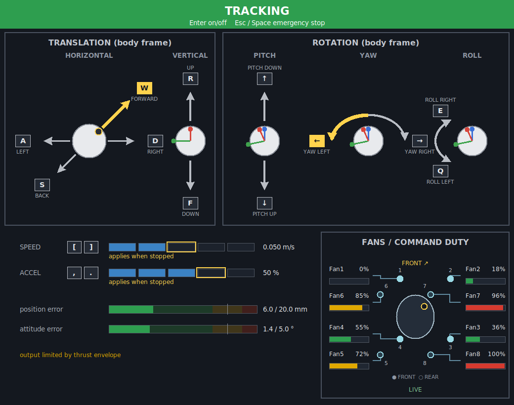
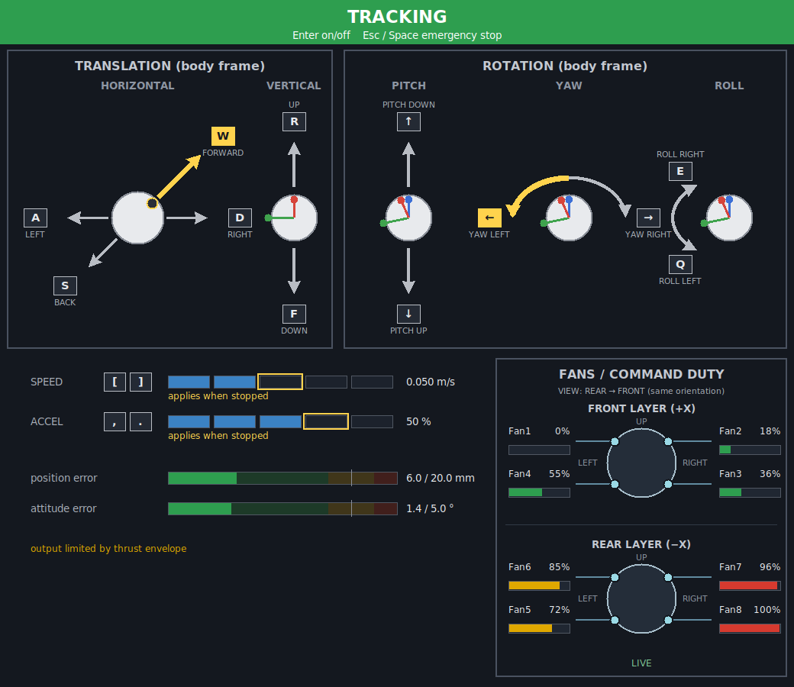
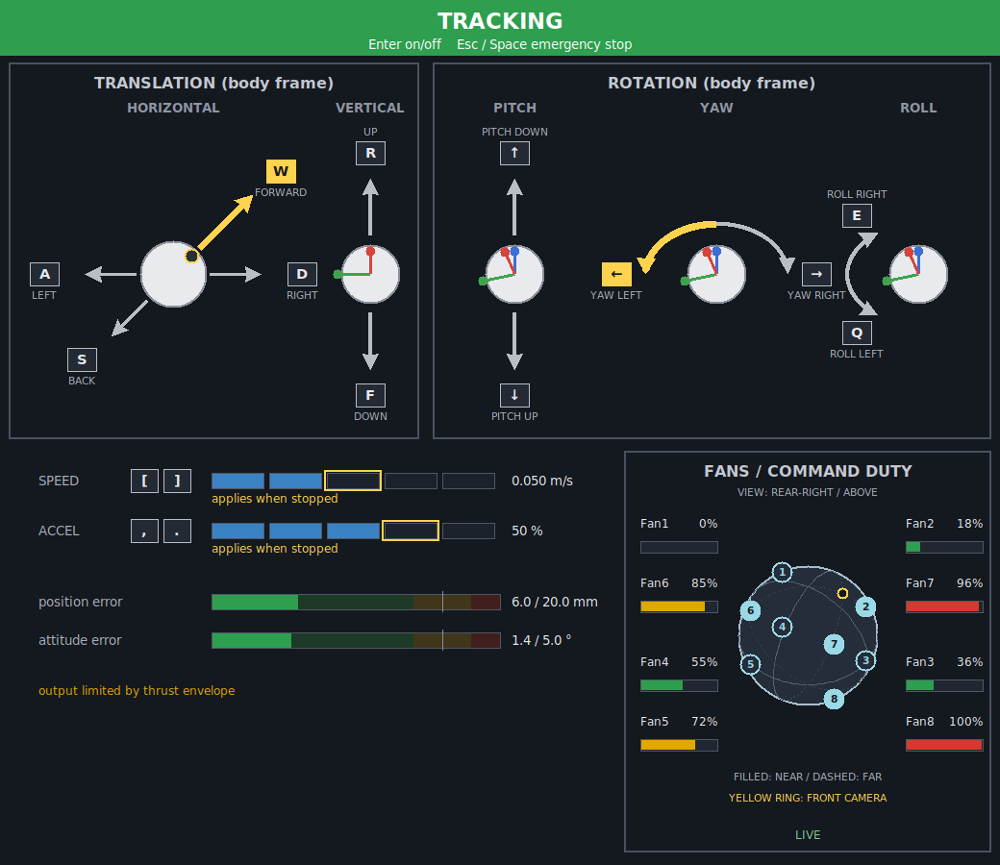

# テレオペGUIのファン表示設計

作成日: 2026-10-02（JST）

本書は `humble-devel` の既存テレオペGUIを対象とする設計・実装記録である。
GUIと受信処理を実装し、サンプル状態で描画・ビルド・関連テストを確認した。
シミュレーション検証はまだ行っていない。

## 1. 目的と要求

- GUIの右下にファン専用の枠を追加する。
- 8基のファンの取り付け配置とFan番号の対応を見せる。
- 各ファンの指令dutyを独立したバーと数値で見せる。
- 引き出し線、機体、文字、バーが重ならず、対応を追いやすい配置にする。
- ユーザーの参考画像は表現の参考とし、寸法や並びをそのまま転用しない。
- 既存の操作表示、キー操作、速度・加速度設定、追従誤差表示を維持する。

## 2. 既存実装の確認結果

| 対象 | 現状 |
|---|---|
| `keyboard_gui.py` | tkinter Canvas、1040×615px、約30Hzで再描画 |
| 上段 | 並進・回転の操作パネル。枠はy=66～456 |
| 下段 | 速度・加速度・位置誤差・姿勢誤差。右下の空きは高さ約150px |
| `TeleopState` | 操作状態・速度・誤差を保持。ファンのdutyや配置情報は未保持 |
| `TeleopLink` | ROSノードとGUI間のスレッド安全な状態受け渡し |
| `/ctl/duty` | `std_msgs/msg/Float64MultiArray`。8要素、Fan1～Fan8の順、0.0～1.0 |
| `gnc_params.yaml` | `thrust_allocator.fan_positions` に8基の取り付け座標を定義 |

既存デザインは `images/teleop_gui.png` と
`images/teleop_gui_stopped.png` で確認した。
GUIはROSを直接扱わず、ROSノードが `TeleopLink` を介して状態を渡す構造になっている。

## 3. 今回採用する方針

事前にユーザーが追加で決めなければ設計できない事項はない。
以下を初期方針とし、寸法・視点・色の細部は静的な描画確認で調整する。

| 項目 | 方針 |
|---|---|
| 表示値 | 実測回転数や実測推力ではなく、受信した「指令duty」 |
| スケール | 全ファン共通の0～100%。バーの長さと数値を併用 |
| 配置 | ファン枠中央に1つの球体図と8基の番号付きマーカー、左右に4行ずつバー |
| Fan番号 | 配信配列と設定の順序に対応するFan1～Fan8を維持 |
| 表示行の順 | 配置図の左右・上下に合わせる。番号順より線の交差回避を優先 |
| 視点 | 機体の斜め後方・右上から見る固定視点 |
| ウィンドウ | 横幅1040px、高さ900px。ファン枠は380×416px |
| テレオペ無効時 | 受信した指令dutyを引き続き表示する |
| 未受信・更新停止 | 0%と区別して `--` と薄いバーで示す |

色は低出力を緑、中間を黄、高出力を赤とする初期案。
高dutyは異常を直接意味しないため、警告・故障の表示とは扱わない。
判定境界を既存の誤差バーからそのまま流用せず、色に依存しない長さと数値で読み取れるようにする。

## 4. レイアウトと重なり防止

```text
┌─────────────────────────────────────────────────────────┐
│                  既存の状態バナー                       │
├───────────────────────┬─────────────────────────────────┤
│     並進操作表示      │          回転操作表示           │
├───────────────────────┴─────────┬───────────────────────┤
│ 速度・加速度                    │ ファン / 指令duty     │
│ 位置誤差・姿勢誤差              │                       │
│ 出力制限などの補足表示          │ 4行 / 球体図 / 4行    │
└─────────────────────────────────┴───────────────────────┘
```

- 上段の座標を維持し、下段を拡張する。
- 下段左側は既存情報、右側はファン枠とし、境界を明示する。
- 既存の下段表示は `H` からの相対座標を見直し、ウィンドウ拡張で必要以上に下へ移動させない。
- 速度・加速度の反映待ち表示と、出力制限の補足表示も左側領域に収める。
- ファン枠内に「配置図」「ラベル・バー」の専用領域を確保する。
- 各行はラベルと数値、その下にバーを置くなど、文字をバーから離して配置する。
- 配置図とバーは同じ番号で対応付け、機体を横切る引き出し線は使わない。
- 設定の3次元座標を固定視点へ投影し、球面上の取り付け位置に番号付きマーカーを置く。
- 球面の大円を描き、手前側の曲線を実線、奥側を薄い破線で表す。
- 視線方向との内積で手前・奥側を判定し、マーカーを塗りつぶし・破線輪郭で区別する。
- 球体と番号付きマーカーの重なりは取り付け位置の表現として意図したものとする。
- 前方の目印を黄色い輪で示す。正確な機体形状やカメラ外形を再現する図ではない。
- フォントの実寸とCanvasの描画範囲を確認し、枠外へのはみ出しも検出する。

ファン枠の幅・行間・バー幅は初期寸法だけで固定せず、8行と日本語／英語の文字を使った描画確認で決める。
左右4行の構成で十分な余白が取れなければ、ウィンドウ幅の拡張を次の調整候補とする。

## 5. 配置情報と受信データ

### ファン配置

`thrust_allocator.fan_positions` を機体座標の取り付け位置として使う。
座標系は x=前方、y=左、z=上。GUI専用の別のファン座標表は作らない。
TeleopNodeが既に読み込む設定から取り出して、ROSに依存しない値としてGUIへ渡す。
ファン番号と配列インデックスの対応は `index + 1` とする。

取り付け配置の図なので、引き出し線を推力方向の矢印にはしない。
推力方向の追加表示は今回の範囲に含めない。

### 指令duty

ROS購読wrapperで `/ctl/duty` を受信し、最新値と受信状態を保持する。
TeleopNodeが `TeleopState` にまとめ、既存の `TeleopLink` 経由でGUIへ渡す。
GUIにROS購読や推力配分計算を置かない。

- 8要素すべてが有限で、0.0～1.0に収まる値か確認する。
- 要素数の不一致や非有限値・範囲外値は有効な0%として扱わない。
- 不正データ受信時は正常表示を継続せず、受信異常を表示する。
- 未受信・正常・更新停止・受信異常を区別できる状態を渡す。
- 受信時刻と経過時間の判定にはノードのrclpy clockを使う。
- 更新停止判定は1秒を初期案とする。シミュレーション時間停止中は経過しない。
- QoSは既存配信経路と互換性を持たせる。最新値を読む浅いキューを使う。
- テレオペの開始・停止やTF取得の成否とは独立してファン情報を更新する。
- テレオペ無効時や非常停止後も、GUI側でdutyを強制的に0%にしない。

## 6. 実装対象

| パス（`gnc_py/sobits_intball2_gnc/` 以下） | 変更案 |
|---|---|
| `teleop/keyboard_gui.py` | 下段レイアウト、配置図、引き出し線、dutyバー、受信状態の描画 |
| `teleop/state.py` | duty、配置情報、受信状態の追加 |
| `teleop/teleop.py` | 配置情報と最新dutyをGUI向け状態へ反映 |
| `teleop/ros/fan_duty_subscriber.py`（新規案） | duty購読、値の検証、受信時刻・状態管理 |

`TeleopLink` は既存の状態受け渡しを使用し、変更が必要かは実装時に判断する。
キー操作、基準軌道生成、制御器、推力配分の変更は予定しない。

## 7. 検証順と完了条件

1. ROSやシムを起動せず、サンプル状態でGUI描画を確認する。
   全0%、全100%、Fanごとに異なる値、未受信・更新停止・受信異常を使う。
   日本語／英語の両方で、8基の番号対応と全描画要素の重なり・はみ出しを確認する。
2. 対象パッケージをビルドし、既存の関連テストを実行する。
   新しい受信処理については、配列検証・番号対応・更新停止判定を必要な範囲で検証する。
3. ビルド・テスト結果を提示し、ユーザーの明示的な許可後にシム検証する。
   実際の `/ctl/duty` と8本の表示を照合し、テレオペ無効時も受信値を表示できることを確認する。

完了条件は、8基の配置とバーの対応が明確で、表示が重ならず、未受信と0%を区別でき、
既存のテレオペ操作に回帰がないこととする。
実装後の結果は本書に追記し、既存GUI画像の更新は実装・検証後に行う。

## 8. 実装とプレビュー確認（2026-10-02 JST）

- GUIを1040×820pxに拡張。下段左に既存の設定・誤差表示、右に380×336pxのファン枠を追加した。
- 配置図と左右4行のバーを実装した。機体座標の設定値を投影し、前側を塗りつぶし、後側を輪郭で区別する。
- 指令duty購読、8要素の値検証、rclpy clockによる1秒の更新停止判定を実装した。
- 未受信・更新停止・受信異常では、値を `--` と空のバーで表示する。
- 最新配列は `TeleopState` と既存 `TeleopLink` で受け渡す。

使用コードは第6節の4ファイルに加え、
`gnc_py/test/manual/teleop_fan_preview.py` と
`gnc_py/test/test_fan_duty_subscriber.py`。
プレビューはROSノードを起動せず、実際のtkinter Canvasをサンプル値で描画して取得した。



| 確認 | 結果 |
|---|---|
| `colcon build --packages-select sobits_intball2_gnc --symlink-install` | 成功 |
| `test_teleop_reference.py` と `test_fan_duty_subscriber.py` | 28件成功 |
| 混在値・全0%・全100%・未受信・更新停止・受信異常の描画 | 6ケース成功 |
| ファンラベル・番号と線／バー／機体／マーカーの重なり、表示枠への収まり | Canvas上の検査成功。混在値と受信異常の画像を目視確認 |
| `git diff --check` | 成功 |

判断: 英語表示の静的プレビューと関連テストは通過した。
この環境にはCJKフォントがないため、日本語描画は未確認で、既存の英語フォールバックを使用する。
実際の `/ctl/duty` との通信・追従中の表示は未検証。

次の確認は、優先順に (1) ユーザーによるプレビュー画像の確認、
(2) CJKフォントのある環境で日本語表示の確認、
(3) 明示的な許可後にシムで `/ctl/duty` と各バーを照合することとする。

## 9. 前後2図への改善（2026-10-02 JST）

ユーザー確認で、初版の斜め図は取り付け位置が読み取りにくいと分かった。
浮いた点の配置をやめ、前側・後側それぞれの機体輪郭上に4基ずつ配置した。
前側は左上Fan1・右上Fan2・左下Fan4・右下Fan3、
後側は左上Fan6・右上Fan7・左下Fan5・右下Fan8となる。
両図は同じ後方視点で、同じ角度位置の前後のファンを比較できる。

HTMLや画像生成による別のモックアップは作らず、
`teleop/keyboard_gui.py` を直接変更し、
`gnc_py/test/manual/teleop_fan_preview.py` で実際のtkinter画面を撮影した。
方向ラベルも重なり検査の対象に追加した。



検証: 対象パッケージのビルド成功、関連テスト28件成功。
混在値・全0%・全100%・未受信・更新停止・受信異常の6ケースで、
ラベルと線・バー・機体・マーカーの重なり検査を通過した。
混在値の画像を目視確認した。日本語表示とシム通信は未確認。

判断: 前後の区分と輪郭への取り付け対応を示せるようになった。
次はユーザーによる新版画像の確認を優先し、以降の確認順は第8節と同じとする。

## 10. 1つの斜め後方・上方図への変更（2026-10-02 JST）

ユーザーの希望に合わせ、機体図を1つに戻し、斜め後方・右上からの固定投影へ変更した。
球体の輪郭と球面上の曲線を描いて立体感を示し、設定の取り付け位置に番号を載せた。
手前のマーカーは明るい塗り、奥側は暗い塗りと破線の縁で区別する。
バーには同じFan番号を表示して対応付ける。投影座標は球体内部にも現れるため、
その位置から機体を横断する引き出し線を描く構成は採用しない。



使用コードは `gnc_py/sobits_intball2_gnc/teleop/keyboard_gui.py`、
画像取得・重なり確認は `gnc_py/test/manual/teleop_fan_preview.py`。
対象パッケージのビルド成功、関連テスト28件成功。
6種類のサンプル状態の描画検査を通過し、混在値の画像を目視確認した。
次はユーザーによる最新画像の確認を優先する。日本語表示とシム通信は未確認。

## 11. シム接続・起動確認（2026-10-02 JST）

ユーザーの許可後、動作中のJAXA制御器とシムを使ってテレオペを起動した。
`/clock`、`iss_body <- body` のTF、8要素の `/ctl/duty` を確認した。
`teleop_node` のduty購読を確認し、同じ `FanDutySubscriber` の別ノードによる受信確認も
`LIVE` となった。受信例は `[0.496, 0.000, 0.543, 0.398, 0.295, 0.518, 0.264, 0.520]`。

初回は既存GNC用RVizを使う判断で `use_rviz:=false` を指定した。
ユーザーの指摘後、`gnc_py/rviz/teleop.rviz` を読み込む `teleop_rviz` を追加起動した。
OpenGL初期化とROSノードを確認し、起動成功と判断した。
ログは `/tmp/teleop_fan_sim.log` と `/tmp/teleop_rviz_sim.log`。

テレオペは待機状態で起動しており、キーを使った移動・停止の検証はまだ行っていない。
次はGUIの実データ表示と専用RVizの視点をユーザーが確認し、
その後に短いキー入力でバーの変化と停止操作を確認する。

追加確認: RVizプロセスは動作していたが、ウィンドウが前面に出ていなかった。
テレオペ用RVizの実際のクライアントウィンドウを前面に出し、デスクトップ画像で
`teleop.rviz` のタイトル、機体・ISSの表示、GUIの `TRACKING` と実dutyの `LIVE` を確認した。
操作中の移動・停止性能を自動で検証したものではない。
